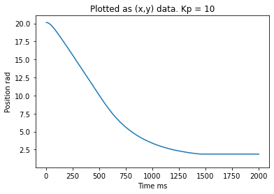
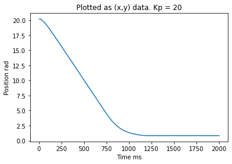

# 405Lab2

This repository contains lab 2
motor go brrrr

## Gitting It Done

This lab requireds us to tune our controller to optimise the responce of the motor. We used just a Kp controller units of %duty/radian. To tune our Kp value we started with a reasonable Kp of 10 %duty/radian since it would need to be 10 radians to have a responce of a duty of 100%. See Figure 1.

__Figure 1:__ Controller Responce, Kp = 10
Having the Kp as 10 resulted is a responce with a large steady state error of 2 radians. To fix this we increased our Kp = 20 %duty/radian. 

__Figure 2:__ Controller Responce, Kp = 20
Having the Kp as 20 resulted is a responce with a slightly smaller steady state error of 0.8 radians we were still not satisfied. To fix this we increased our Kp = 50 %duty/radian. 

__Figure 3:__ Controller Responce, Kp = 50
Having our Kp equal 50 resulted in vertually no steady state error and also no overshoot. Kp of 50 is our final controller preportional gain.

### Classes

* [Encoder.py](https://github.com/QuietJohn0/405Lab2/blob/main/src/Encoder.py)
* [motor_driver.py](https://github.com/QuietJohn0/405Lab2/blob/main/src/motor_driver.py)
* [main.py](https://github.com/QuietJohn0/405Lab2/blob/main/src/main.py)
* [closedloop.py](https://github.com/QuietJohn0/405Lab2/blob/main/src/closedloop.py)

### Class run by the PC

* [Lab02_PC](https://github.com/QuietJohn0/405Lab2/blob/main/src/Lab02_PC.py)

## Documentation

* [Lab02 Documentation](https://github.com/QuietJohn0/405Lab2/tree/main/docs)

## Website Link

* [Lab02 Website](https://quietjohn0.github.io/405Lab2/index.html)
