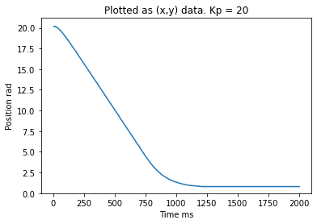
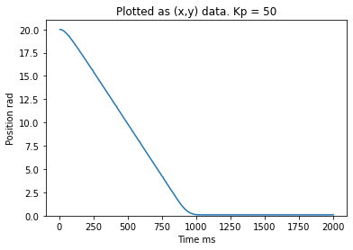

# 405Lab2

This repository contains lab 2
motor go brrrr

## Gitting It Done

This lab requireds us to tune our 

### Classes

* [Encoder.py](https://github.com/QuietJohn0/405Lab2/blob/main/src/Encoder.py)
* [motor_driver.py](https://github.com/QuietJohn0/405Lab2/blob/main/src/motor_driver.py)
* [main.py](https://github.com/QuietJohn0/405Lab2/blob/main/src/main.py)
* [closedloop.py](https://github.com/QuietJohn0/405Lab2/blob/main/src/closedloop.py)

### Class run by the PC

* [Lab02_PC](https://github.com/QuietJohn0/405Lab2/blob/main/src/Lab02_PC.py)

## Documentation

* [Lab02 Documentation](https://github.com/QuietJohn0/405Lab2/tree/main/docs)

## Website Link

* [Lab02 Website](https://quietjohn0.github.io/405Lab2/index.html)
